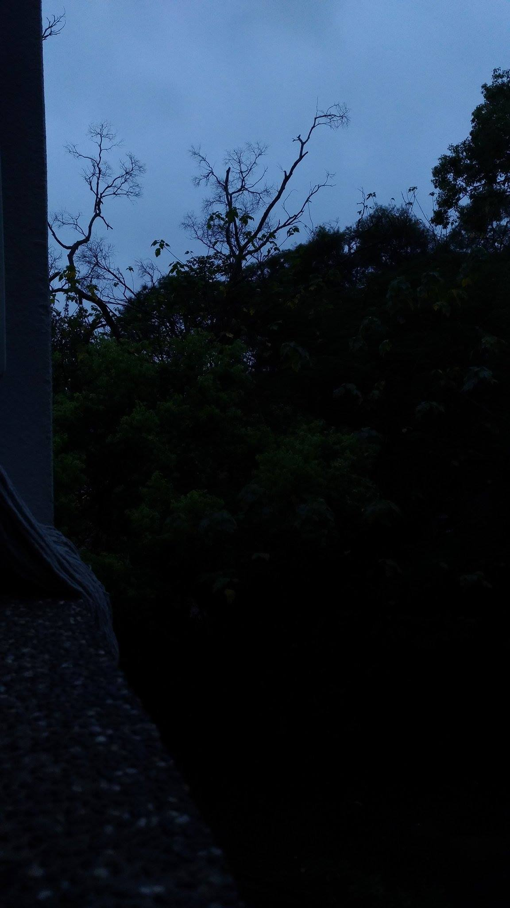
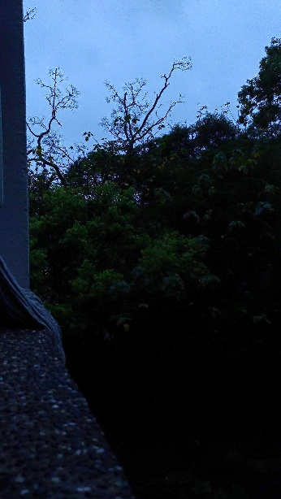
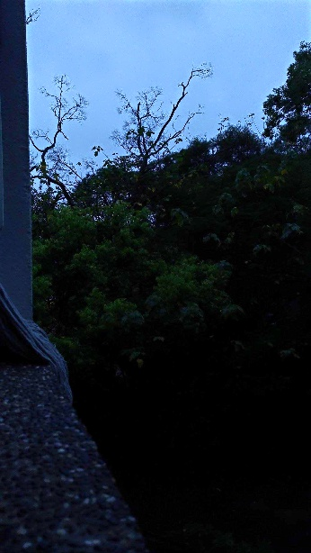

# Two_Scale_Tone_Mapping
reference: two-scale tone management for photographic look

reference: Fast Bilateral Filtering for the Display of High-Dynamic-Range Images

### This code has two decomposition method, bilateral filter and L0 norm.

## L0 decomposition
reference: https://github.com/t-suzuki/l0_gradient_minimization_test

## Running
input_image output_image(without file name) 'BF'/'L0'

## results
 - input image

    
 - output image of bilateral filter

    
 - output image of L0 norm
 
    

